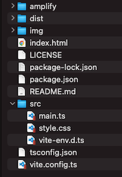

# amazon-location-service-starter


Start Amazon Location Service easily.  
- [AWS Amplify v4.3.30](https://github.com/aws-amplify/amplify-js)  
- [MapLibre GL JS Amplify v2.0.2](https://github.com/aws-amplify/maplibre-gl-js-amplify)  
- [MapLibre GL JS v2.1.9](https://github.com/maplibre/maplibre-gl-js)  
- [TypeScript v4.7.4](https://www.typescriptlang.org)  
- [Vite v3.0.4](https://vitejs.dev)  
- node v18.1.0
- npm v8.8.0

<br>

## Usage



<br>

Install AWS Amplify
```bash
npm install -g @aws-amplify/cli
amplify configure
```
- [AWS Amplify #001 - Install](https://day-journal.com/memo/aws-amplify-001)

<br>

Install package
```bash
npm install
```

<br>

AWS Amplify environment
```bash
amplify init
amplify push
```
- [AWS Amplify #002 - Building the Environment](https://day-journal.com/memo/aws-amplify-002)

<br>

Change "aws-exports.js" to "aws-exports.ts".

```bash
aws-exports.ts
```

<br>

build
```bash
npm run build
```

<br>

dev
```bash
npm run dev
```

---

<br>
<br>


<br>

## License
MIT

Copyright (c) 2021-2022 Yasunori Kirimoto

<br>

---

<br>

### Japanese

<br>

# Amazon Location Service スターター


Amazon Location Serviceを手軽に始める
- [AWS Amplify v4.3.30](https://github.com/aws-amplify/amplify-js)  
- [MapLibre GL JS Amplify v2.0.2](https://github.com/aws-amplify/maplibre-gl-js-amplify)  
- [MapLibre GL JS v2.1.9](https://github.com/maplibre/maplibre-gl-js)  
- [TypeScript v4.7.4](https://www.typescriptlang.org)  
- [Vite v3.0.4](https://vitejs.dev)  
- node v18.1.0
- npm v8.8.0

<br>

##  使用方法


<br>

AWS Amplifyインストール
```bash
npm install -g @aws-amplify/cli
amplify configure
```
[AWS Amplify #001 - インストール](https://day-journal.com/memo/aws-amplify-001)

<br>

パッケージインストール
```bash
npm install
```

<br>

AWS Amplify設定
```bash
amplify init
amplify push
```
[AWS Amplify #002 - 環境構築](https://day-journal.com/memo/aws-amplify-002)

<br>

aws-exports.jsをaws-exports.tsに変更

```bash
aws-exports.ts
```

<br>

ビルド
```bash
npm run build
```

<br>

開発
```bash
npm run dev
```

<br>
<br>


<br>

## ライセンス
MIT

Copyright (c) 2021-2022 Yasunori Kirimoto

<br>
